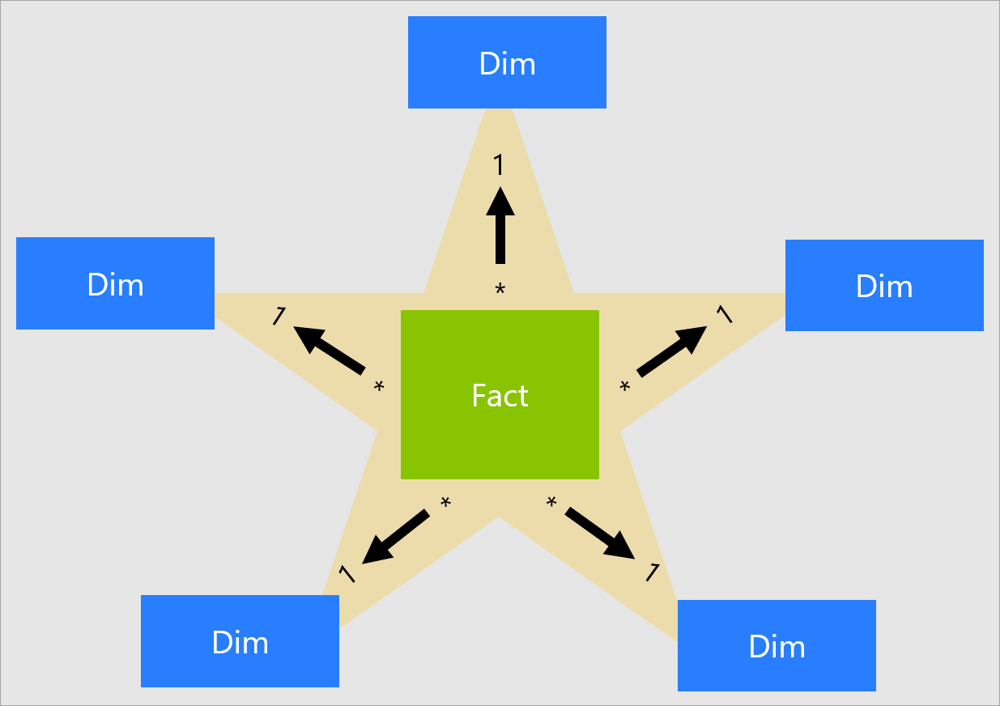

##Join Query Support
StarTree Cube can help optimize aggregation over join queries as well. The optimizer looks for aggregation subtree pattern in the logical plan that typically looks like following.
```
  AggregationNode
  |- ProjectNode[Optional]
  .  |- ProjectNode[Optional]
  .  .  |- FilterNode[Optional]
  .  .  .  |- JoinNode
  .  .  .  .  [More Joins]
  .  .  .  .  .
  .  .  .  .  |- ProjectNode[Optional] - Left
  .  .  .  .  .  |- TableScanNode [Fact Table]
  .  .  .  .  |- ProjectNode[Optional] - Right
  .  .  .  .  .  |- TableScanNode [Dim Table]
```

If the query matches the pattern, the optimizer rewrites the logical plan by replacing the Fact TableScanNode with Cube TableScanNode. This is similar to the single 
table rewrite.

###Star Schema Support
Join Query optimizer supports star schema only. A star schema is a data warehousing architecture model where one fact table references multiple dimension tables, which, when viewed as a diagram, 
looks like a star with the fact table in the center and the dimension tables radiating from it. All kinds of joins are supported.



###Cube Management
`Create Cube` can be still be used to define Cubes to optimize Join queries as well. The difficult part is identifying GROUP construct while building the Cubes. With single table 
queries, the GROUP BY clause will contain columns only from same the table. But with join queries, especially star schema queries, the GROUP BY contain columns from Dimension tables and not the Fact table. 
Let's analyze more with following query
```sql
SELECT SUM(lo_revenue) AS lo_revenue, d_year, p_brand
FROM lineorder
LEFT JOIN dates ON lo_orderdate = d_datekey
LEFT JOIN part on lo_partkey = p_partkey
LEFT JOIN supplier on lo_suppkey = s_suppkey
WHERE p_category = 'MFGR#12' AND s_region = 'AMERICA'
GROUP BY d_year, p_brand
ORDER BY d_year, p_brand;
```

Here `lineorder` is the Fact table and `dates`, `part`, `supplier` are the Dimension tables. Cubes will be defined on the `lineorder` table. The group by columns `d_year`, `p_brand` are part 
of the dimension tables `dates` and `part` appropriately. They cannot be used directly in `CREATE CUBE` statement. The proper solution is to use the foreign key columns of `lineorder` table in 
the GROUP construct while building Cubes.
```sql
CREATE CUBE lineorder_cube ON lineorder WITH(
AGGREGATIONS = (sum(lo_revenue)),
GROUP = (lo_orderdate, lo_partkey, lo_suppkey));
```
The optimizer parses the join conditions and uses those columns to identify the matching Cubes. The performance gain is realized if Cube size is smaller than fact table.

###Limitations
* Only star schema is supported.
* Count distinct not supported because Cube does not store actual dimension values.
* Queries won't be optimized if Cubes are defined on both Fact and Dimension as the optimizer does not have capability to differentiate between two.
* If Cubes are defined on more than one table of the Join query - then Optimizer does not work. Assumption is that Cubes are defined only the Fact table.
* Supports only simple aggregation like SUM, COUNT, AVG, MIN, MAX - defined on Single column. Cube does not support SUM(revenue - supplycost) aggregation. The following query cannot be optimized using Cube.
```
   SELECT sum(lo_extendedprice * lo_discount) AS revenue
   FROM lineorder
   WHERE toYear(lo_orderdate) = 1993 AND lo_discount BETWEEN 1 AND 3 AND lo_quantity < 25;
```

###Future
* Support for snowflake schema
* Building a single cube over multiple tables